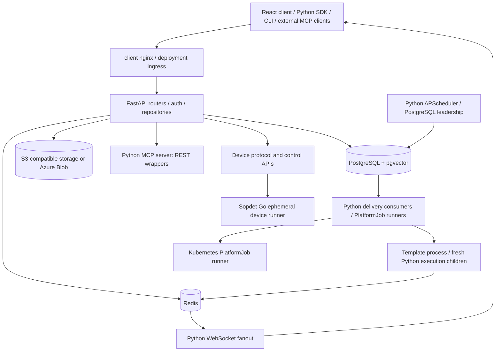
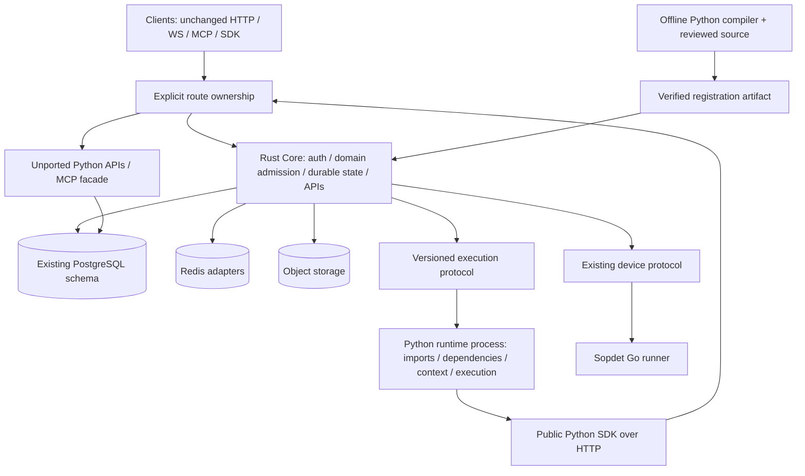
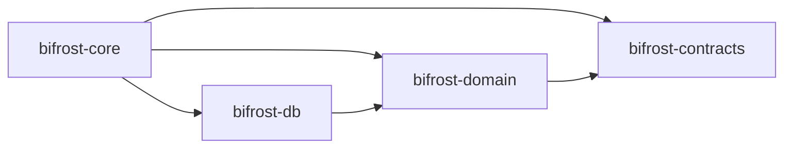

# RFC: Rust control plane, Python execution runtime

Status: proposed; architecture only. No subsystem is ported or traffic moved by
this RFC. Design date: 2026-10-01. Accountable owner: platform architect; builders
implement bounded packages only after the corresponding review gate.

## 1. Baseline and decision

Design against fetched `origin/main`, not a historical diagram:

| Repository | Exact design head | Verified prerequisite |
| --- | --- | --- |
| [Midtown-Technology-Group/bifrost](https://github.com/Midtown-Technology-Group/bifrost) | [d39aa0adf15ba12dfde5f2f39628cac88c2e98a0](https://github.com/Midtown-Technology-Group/bifrost/commit/d39aa0adf15ba12dfde5f2f39628cac88c2e98a0) | [#1001](https://github.com/Midtown-Technology-Group/bifrost/pull/1001), merged at this head |
| [MTG-Thomas/bifrost-workspace](https://github.com/MTG-Thomas/bifrost-workspace) | [a05030ed42a7d2da808c1ec8020c050d87e19b31](https://github.com/MTG-Thomas/bifrost-workspace/commit/a05030ed42a7d2da808c1ec8020c050d87e19b31) | [#1112](https://github.com/MTG-Thomas/bifrost-workspace/pull/1112), merged at this head |

Both merge identities are ancestors of the fetched heads (indeed equal).
Workspace inspection used a detached worktree at the design SHA, rather than the
pre-existing local branch. Running its own
`scripts/test-python-quality.py` functions `boundary_python_files()` and
`check_platform_internal_imports()` found **2,095 authored Python files, zero
internal-import findings, and an empty `PLATFORM_INTERNAL_IMPORT_ALLOWLIST`**.
The AST gate rejects `src.*` and SQLAlchemy imports. Reviewed
`sys.path` candidates in `_codex_bulk_register_workflows.py` and
`apply_autotask_kb_inline_images_browser.py` point inside the workspace, not to a
sibling platform API. Public OAuth administration and execution sanitation are
HTTP SDK operations (`api/bifrost/oauth_admin.py`, `executions.py`), with original
caller authorization and transactionally persisted audit on the server.
No boundary regression was found. This is source evidence, not a deployed SDK
or live instance audit.

**Recommendation: proceed with a bounded falsification experiment, not approval
for a wholesale rewrite.** Rust can own durable control-plane state and public
contracts; Python should continue owning Python execution, dependency resolution,
static Python compilation tools, and initially the Pydantic AI agent runtime.
The runtime extraction is a harder problem than replacing FastAPI routes.

Use the decision map in sections 12–14 as the builder frontier. The first open
packages are W0-A and W0-B; later packages cannot improvise unresolved decisions.
No Cargo scaffolding is added here: pinning a toolchain, resolving dependencies
and extending CI belong together in W0-A. An empty workspace would provide no
architectural evidence.

## 2. Current main: source architecture

Paths below are relative to the platform repository unless labeled workspace.
Source behavior takes precedence over comments and architecture documents.



### Control, delivery and execution

- `api/src/routers/`, `core/auth.py`, `core/principal.py`, repositories and
  `models/contracts/` implement HTTP, identity, org scope and DTOs. React's
  `client/src/services/` and generated OpenAPI types consume these routes.
  `client/nginx.conf` fronts the SPA, rewrites `/api/auth` to `/auth`, proxies
  `/api`, health/docs and WebSockets, and has optional renderer upstreams.
- `jobs/postgres_delivery.py` adapts PostgreSQL claims to shared consumer outcome
  policy in `jobs/rabbitmq.py`. `services/work_delivery_store.py` owns encrypted
  envelopes, transactional enqueue, `SKIP LOCKED` claims, tokens, lease renewal,
  settlement, interruption and domain-aware recovery. PostgreSQL delivery is
  the migration architecture. **Configuration discrepancy:** `src/config.py`
  still defaults `work_delivery_backend` to `rabbitmq`; Compose interpolation
  and `k8s/configmap.yaml` do too. The repo alone therefore does not prove a live
  instance uses PostgreSQL. Before any worker cutover, read its actual setting
  and establish PostgreSQL parity. Do not add a Rust RabbitMQ transport.
- `services/execution/attempts.py` and `models/orm/executions.py` maintain
  workflow-specific durable dispatch/claim/run evidence.
  `models/orm/execution_attempts.py` and `services/execution_attempts.py` contain
  a separate generalized runner-attempt model. These are distinct tables and
  vocabularies; do not conflate them during a port.
- `worker/app.py` owns consumer supervision and pause/drain; durable
  `services/worker_control_commands.py` claims commands and uses Redis hints.
  Runtime maintenance sealing in `services/runtime_maintenance.py` participates
  in enqueue and claim admission. A Rust claim loop must respect it.
- `services/execution/process_pool.py` forks one-shot children from a long-lived
  template, bounds concurrency and cgroup pressure, watches crashes/timeouts,
  and drains/restarts the template after package installation. It is not a
  conventional warm worker pool. `template_process.py`, `worker.py`,
  `engine.py`, `simple_worker.py` and `requirements_setup_helper.py` combine
  Python execution with platform persistence/telemetry today.
- `virtual_import.py` and `core/module_cache_sync.py` resolve virtual modules
  through Redis; `module_loader.py` invalidates inherited workspace imports
  on generation changes. Redis module reads are Python-only. `RepoStorage` and
  object storage own content; mutable module-cache state must not override
  immutable Solution deployment pins.
- `scheduler/main.py`, `leadership.py`, `registry.py` and `jobs/schedulers/`
  implement cron/deferred admission, cleanup, OAuth renewal, reconciliation,
  device watchdog and other maintenance. The trigger leader has a PostgreSQL
  token lease (30 seconds), safe for transaction-pooling connections; there is
  no justification for two active trigger schedulers.
- `services/platform_jobs.py`, `jobs/platform/base.py` and `registry.py` own
  durable non-workflow jobs, resource/retry/cancel policies and outcomes.
  `jobs/platform/kubernetes_client.py`, `kubernetes_runner.py` and
  `services/kubernetes_execution.py` run configured remote PlatformJob types
  and reconcile Kubernetes evidence. Kubernetes is not proof that all workflows
  run as individual Kubernetes Jobs. Preserve the registry and operator API.

### Identity, policy, agents, events and storage

- `UserPrincipal` distinguishes transport identity from original delegated
  identity, superuser from agent-domain role grants, provider-org bypass,
  external restrictions, embed grants, engine attempt tokens and service
  identities. `auth.py` checks active engine attempts. Replacing it with a
  generic JWT-to-user-ID extractor would weaken authorization.
- `core/org_filter.py` (and repository scope rules),
  `services/policy_rule_service.py`, `table_policy_loader.py`,
  `file_policy_service.py`, `core/solution_delivery_policy.py` and
  `routers/agent_action_approvals.py` enforce different access/policy boundaries.
  Policy decisions, pending approvals and audit must remain durable and scoped;
  do not convert all grants into a single admin boolean.
- `services/agent_executor.py`, `execution/autonomous_agent_executor.py`,
  `agent_run_service.py`, `agent_workflow_tools.py` and `services/agent_runtime/`
  own agents, model retry/failover, tool dispatch, budgets and usage. Keep
  Pydantic AI/model orchestration Python initially; extract run admission,
  approvals, attempts and cancellation separately. A Rust model SDK is not
  sufficient evidence to replace this behavior.
- `services/mcp_server/server.py`, `gateway.py`, `middleware.py`, `auth.py`,
  `tasks.py` and `tools/_http_bridge.py` implement MCP transport, scoped catalogs,
  REST-backed tools and operation receipts; `services/mcp_client/` handles
  external connections, OAuth binding, discovery and dispatch. Keep the Python
  MCP facade during early route ports: REST wrapping is already a useful seam.
- `core/pubsub.py` and `routers/websocket.py` fan out events through Redis;
  chat-run replay uses streams and sequence allocation. Device WebSocket
  notifications are lossy hints; authenticated HTTP/DB state is authoritative.
  Browser connection authorization and tenant channel selection remain Python
  until separately characterized.
- `services/file_storage/{s3_client,azure_blob_client}.py` and `repo_storage.py`
  implement content storage. Deployment/resource/bundle/artifact storage adds
  pinning and retention semantics above the provider. S3-compatible SeaweedFS
  appears in Compose; Azure Blob is a supported provider. Preserve digest,
  prefix, URL, encryption, metadata and missing-object behavior, not just PUT/GET.
- `api/alembic/` is the schema history. PostgreSQL is shared during coexistence;
  SQLAlchemy relationships are implementation conveniences, not Rust domains.

### Sopdet is a device runner

`routers/device_protocol.py` has five agent-facing POST routes: heartbeat,
claim, running, logs and result. `services/device_keys.py` authenticates `bfdk_`
keys with bcrypt over the parsed secret component (not the full 85-byte key); registered device status/enabled checks precede operations.
`routers/devices.py`, `device_jobs.py` and `device_control_keys.py` provide
operator/control-key access. Device control keys and device agent keys are
separate authority domains; do not admit one in place of the other.

`services/device_jobs.py` and the device tables implement:

- One active pending/claimed/running job per device (partial unique index).
  Claim uses a 60-second pre-spawn lease, fresh UUID token and agent session.
- Explicit claimed → running **after the runner's actual process spawn**.
  Same-token running replay is idempotent; logs/results remain token-fenced.
- Heartbeat renewal binds activity to the owning session; logs are bounded,
  sequence-idempotent and conflict on different content at an accepted sequence.
- Agent result statuses: succeeded, failed, timeout, cancelled. `lost` is
  server-only. Result replay does not automatically mean successful idempotency:
  retain current terminal conflict behavior.
- Watchdog: 90 seconds of running inactivity or timeout plus 60 seconds produces
  terminal `lost`. Stale claimed work is reclaimable in place; running work is
  never automatically replayed. Pending/claimed cancel is terminal; running
  cancel is cooperative and does not guarantee an OS process kill.

The spawn-before-running-ack interval is inherently ambiguous. Preserve the Go
runner's current recovery behavior and test a killed connection in that interval;
never claim the server state alone proves no process spawned. The Go client is an
external compatibility consumer, not inspected in these two repositories; its
exact repository/ref and executable test command must be pinned before canary.
Direct Sopdet transport and applicable Ninja fallback remain supported. No
WinRM/PSRP requirement is introduced.

## 3. Coupling and compatibility map

| Classification | Concrete paths | Migration disposition |
| --- | --- | --- |
| Control plane | `routers/device_protocol.py`, `services/device_jobs.py`, `device_keys.py`, repositories, scheduler leadership, `work_delivery_store.py` | Port bounded state machines against existing schema and parity fixtures |
| Python runtime | `execution/module_loader.py`, `virtual_import.py`, `import_restrictor.py`, `type_inference.py`, `requirements_setup_helper.py` | Keep Python; receive pins and capabilities through protocol |
| Mixed execution | `execution/engine.py`, `worker.py`, `process_pool.py`, `service.py`, `attempts.py`, `service_claim.py` | Separate process supervision/import from DB admission/finalization; no mechanical translation |
| Mixed agents | `agent_executor.py`, `execution/autonomous_agent_executor.py`, `agent_runtime/` | Python model/tool runtime; Rust durable run/approval controller later |
| Reviewed delivery | `bifrost/solution_delivery_review.py`, `workflow_parameters.py`, `services/solutions/workflow_revision_recipe.py`, `deployment_manifest.py`, `deployment_runtime.py` | Python offline compiler retained; Rust validates compiled registration and immutable closure |
| HTTP SDK | `bifrost/client.py`, `config.py`, `integrations.py`, `tables.py`, `workflows.py`, `executions.py`, `oauth_admin.py`, `platform_jobs.py`, `resources.py` | Preserve methods, routes, retry classification and exceptions; switch implementation behind HTTP |
| Execution-local SDK | `_context.py`, `_execution_context.py`, `org_target.py`, `solution_binding.py` | Preserve context proxy, scope override rules, original caller, own-install lookup and secret registration |
| Runtime-local SDK | `_logging.py`, `_local_resources.py`, `_service_runtime.py`, `decorators.py`, `models.py` | Preserve logs/resources/decorator/service behavior; replace transport adapters incrementally |
| CLI-only | `cli.py`, `commands/`, `solution_dev/`, `credentials.py`, `git_commands.py`, `solution_delivery_review.py` | Keep Python, including local runs and reviewed recipe generation |
| Python-backend assumptions | `_logging.py`, `_sync.py`, `_write_buffer.py`, `__init__.py`, `manifest.py`, `_execution_context.py` | Extraction blockers; explicit adapter work, not workspace import exceptions |
| Schema | `models/orm/{work_deliveries,executions,execution_attempts,device_jobs,device_job_logs,platform_jobs,worker_control_commands,solution_deployments}.py`, Alembic | Inspect actual migrated schema; hand-design Rust domain types |

Important details behind the last SDK row:

- `__init__.py` preferentially loads platform decorators/errors and reads the
  platform enums file; standalone fallback exists. Preserve class/error identity
  where callers rely on it, and make the packaged definitions canonical only
  after compatibility tests.
- `_logging.py` imports `src` cache/log-safety helpers and can flush to ORM logs;
  `_write_buffer.py` uses Redis key/TTL contracts; `_sync.py` persists buffered
  mutations through SQLAlchemy. These are internal SDK implementations, not a
  regression in workspace-authored imports. They prevent immediately deleting
  Python platform modules.
- `ExecutionContext` retains a private `_db` and public `db` property. Do not send
  a SQLAlchemy session over the execution boundary. Audit consumers before
  removal; any supported `context.db` use needs an explicit compatibility or
  deprecation decision. Never offer remote SQL as the replacement.
- SDK retries distinguish idempotent reads, retry-safe operations, transport
  failure and transient server failure. OAuth recovery/single-use exchanges must
  not be retried merely because Rust uses reqwest.

### Metadata discovery: progress and remaining imports

Reviewed recipes use `bifrost.solution-workflow-delivery/v1`, explicit path,
function, identity, scope, registration controls, runtime bounds and source maps.
`workflow_parameters.py` compiles JSON parameter schemas from AST; the indexer
in `services/file_storage/indexers/workflow.py` also uses AST, **not imports**.
This is a substantial enabler. Keep this Python compiler as an offline tool;
Rust does not need to reimplement Python's parser.

Remaining import-time coupling is concrete: `services/workflow_validation.py`
imports a temporary module to discover decorated metadata (called from workflow
validation API paths); `execution/service.py` executes source and scans
`_executable_metadata`; `execution/worker.py` loads decorated callables via
`module_loader.py`. The latter are runtime work and should move behind the
boundary; validation should become a Python diagnostic job, never authoritative
Rust registration discovery. Loose/root source writes still invoke Python AST
indexing server-side. Keep those routes Python until a compiler request/result
contract exists. Reviewed registration must never adopt arbitrary import-time
metadata or a client's unsigned schema as authority.

Proposed compiler artifact carries schema version, compiler version, exact Git
commit, recipe/source/resource hashes, parameter schemas, complete registration
controls, bounds and dependency/root binding closure. Rust verifies it against
reviewed provenance and supplied bytes before atomic activation; rejects unknown
compiler versions and incomplete closure. Trusted CI generation is not a bypass
of server authorization, CAS, natural-key identity or protected-registration
checks. Promotion acknowledgements, R0/R1/R2 gates and source accountability stay
intact. Dynamic annotations not statically representable cause a diagnostic/stop,
not a server import fallback.

## 4. Target and Python boundary



Python initially retains the full runtime image, one-shot fork/template strategy,
requirements setup/recycle, virtual imports, decorators/signature coercion,
inline scripts, tracing variables, secret scrubbing, data-provider execution and
cache behavior, service coroutine supervision, local CLI runs and AI/model/tool
orchestration. Rust owns these domains only after their package gates pass.
Python AST recipe compilation may remain Python permanently; likewise agent
model orchestration if its Rust replacement adds no maintainability benefit.

No PyO3, embedded interpreter or Rust/Python callback mesh. The runtime is a
separate executable with serializable requests/events. Its SDK HTTP calls are
public operations with attempt-scoped delegated authority, not arbitrary backend
service calls. During extraction Python adapters may still import existing
platform modules **inside the Python runtime image**; track and remove DB writes
before Rust becomes the execution-state owner. Rust never imports Python.

## 5. Proposed execution protocol: `bifrost.execution/v1`

This is a proposal to characterize and ratify in W3-A, not an existing endpoint.
Use internal authenticated HTTPS JSON claim/control/report operations initially;
no gRPC framework, broker or custom multiplexed socket is needed. The Rust
coordinator claims durable delivery and admits the attempt; the runtime asks for
work only when it has capacity. Do not grant runtime arbitrary queue-row access.
Persist admission and immutable envelope reference before dispatch. Do not hold
SQL transactions while running user code. Keep delivery completion boundaries
per `jobs/execution_policy.py`: workflow child dispatch is different from a
durable domain outcome; delivery ack and workflow success are different facts.

A representative admitted **workflow** envelope:

```json
{
  "schema": "bifrost.execution/v1",
  "kind": "workflow",
  "runtime": {"name": "python", "protocol": 1, "environment_digest": "sha256:<requirements-and-image-digest>"},
  "execution_id": "<uuid>",
  "workflow_id": "<uuid>",
  "attempt": {"id": "<uuid>", "number": 1, "policy_digest": "sha256:<digest>"},
  "source": {
    "kind": "solution_deployment",
    "solution_id": "<uuid>",
    "deployment_id": "<uuid>",
    "manifest_digest": "sha256:<digest>",
    "entrypoint": {"path": "workflows/example.py", "function": "run"},
    "entrypoint_digest": "sha256:<digest>",
    "closure_digest": "sha256:<dependency-and-root-binding-digest>",
    "resource_manifest_digest": "sha256:<digest>"
  },
  "identity": {
    "original_caller": {"user_id": "<uuid>", "email": "<email>", "name": "<display>", "is_platform_admin": false, "is_provider_org": false, "is_external": false},
    "target_scope": {"kind": "organization", "organization_id": "<uuid>"},
    "transport_principal": "engine",
    "caller_solution_id": "<uuid>"
  },
  "context": {"parameters": {}, "startup": null, "form_inputs": {}, "embed": {}, "event": null, "roi": {"time_saved": 0, "value": 0}, "artifact_workspace_id": null, "public_url": "https://<instance>"},
  "options": {"transient": false, "no_cache": false, "cache_ttl_seconds": 0},
  "limits": {"timeout_seconds": 1800, "memory_bytes": null, "output_bytes": null, "reviewed_bounds": null},
  "reporting": {"session_id": "<uuid>", "event_schema": "bifrost.runtime-event/v1"},
  "trace": {"traceparent": "<W3C-trace-context>"}
}
```

Angle-bracket values are illustrative. IDs/digests are validated canonical
strings; budgets are nonnegative bounded integers; JSON cannot contain Python
callables, sessions, exceptions, broadcaster objects, NaN or pickle payloads.
Keep `null` distinct from absent. Global scope is a tagged alternative with no
organization UUID, not an inferred default. Caller flags are coordinator-minted
facts, not client assertions; authorization remains server-side on every SDK
request. Preserve caller organization/provider membership separately from target
scope. Role/capability resolution remains on the server, not trusted runtime
input. Never serialize raw secrets in diagnostic fixtures.

Source is a discriminated union: Solution deployment above; root/loose source
with an immutable release or captured generation **and complete hash closure**;
inline script with an immutable content reference/digest. Never silently use
latest source if a pin disappears. Same-Solution nested calls inherit deployment;
dependency calls resolve the manifest's pinned deployment/root bindings. Unknown
source kinds fail before import. Initial envelope memory/output limits may be
null where current policy has no per-attempt enforcement; do not pretend the
example's 512 MiB limit exists today. Runtime advertises enforced capabilities;
reject an admission requiring unsupported hard limits.

Transport authentication is separate from the document: short-lived,
attempt/session-bound credentials passed in headers or a protected credential
channel; no global API key, DB password, signing key or object-store credential
in envelopes/logs. Preserve active-attempt token checks from `core/auth.py`,
engine/delegated identity separation, cancellation revocation and service token
renewal. Runtime receives immutable content through scoped retrieval; verify
hashes before imports. Log scrubbing runs locally before transmission and the
server protects persisted/API output as today.

### Lifecycle and reports

1. Domain admission, retry-policy snapshot, attempt dispatch evidence and enqueue
   commit together. Queue claim count is **not** attempt number.
2. Coordinator claims/renews delivery with existing DB-clock/token rules, fences
   admission under domain lock, and binds an attempt/session to a runtime.
3. Runtime validates version/pins/environment, admits capacity, and reports
   `accepted` then phase updates (`admission`, `execution`, `result`). A running
   report contains process identity and existing attempt fencing authority.
4. Runtime polls control while running; heartbeat does not imply success.
   Monotonic control generation carries cancel, stop, drain or ownership loss.
   Pause prevents new admissions, drain waits for tracked work, recycle drains
   the Python template. Service cooperative stop is distinct from workflow
   timeout/kill and needs a service variant before it is migrated.
5. Reports use `(attempt_id, session_id, sequence)` and fenced session authority.
   Event types include heartbeat, logs, variables/checkpoints, integration usage,
   ROI, ready (services) and terminal outcome. Same sequence/same payload is
   replay-safe; same sequence/different payload is a conflict. Bound batches,
   result sizes and backpressure. Event sequencing is per attempt, not a claim
   that every existing WebSocket event is durably delivered.
6. Finalization atomically accepts only the current active attempt, persists
   outcome/context/metrics and lifecycle evidence, then emits existing events.
   Terminal acknowledgement can be retried with an identical report; losing the
   ack never authorizes rerunning code. Reconnect queries outcome/control before
   resuming reports. Reject stale attempts after retry/cancel.
7. Lost session/lease produces domain-aware interruption/recovery, never generic
   replay after a possible side effect. Workflow retry requires the pinned
   workflow policy **and** operator ceiling (`retry_policy.py`, default ceiling
   one); agents with ambiguous tool execution terminalize worker_lost; derived
   summaries have their bounded retry/accounting behavior.

The event acceptance/idempotency journal is a **new protocol requirement**.
Ratify its persistence and retention before execution cutover; if existing
attempt/log tables cannot support it, add an additive Alembic migration in that
package. Do not invent a competing SQLx migration directory. Maximum outage
buffering, credential expiry while offline and terminal payload scrubbing are
W3-A decisions. Runtime protocol v1 is not the Sopdet device wire protocol; do
not replace the latter with this envelope.

## 6. PostgreSQL durability and schema ownership

Alembic remains authoritative. Python init runs migrations once before either
service starts. Rust only checks supported revision/schema capabilities and uses
SQLx repositories; it neither runs historical migrations nor creates schema.
Relevant revisions include `20260919_postgres_delivery`,
`20260920_ai_delivery_fences`, `20260831_execution_attempts`,
`20260826_execution_attempts`, `20260716_execution_deployment_pin`,
`20260716_solution_deployments`, and the September 23–24 device/key/job/log
revisions. Inspect the full migration graph, not just filenames, to establish a
schema floor. Read types/indexes/checks from a migrated database.

Use SQLx typed SQL/row structs with hand-designed domains. Compile-time query
metadata is generated against a disposable DB migrated by Alembic, committed
under `core-rs/.sqlx/`, and checked in CI with offline compilation plus an online
prepare freshness check. Dynamic SQL is allowed for bounded predicates with
integration tests; avoid an ORM or automatically deriving from SQLAlchemy.
Use PgBouncer transaction-pooling-compatible transaction advisory locks and
explicit connection options for statement caching; prove behavior through
PgBouncer rather than assuming session affinity.

Port these delivery contracts before optimization:

| Contract | Initial parity requirement |
| --- | --- |
| Enqueue | Domain admission and encrypted envelope in one transaction; active `(queue_name,message_id)` partial unique upsert includes interrupted rows |
| Claim | Due queued rows, availability/ID order, `SKIP LOCKED`, maximum 100, new UUID token, increment claim count, 90-second lease; respect maintenance seal |
| Ownership | Current claimed row/token/unexpired DB-clock lease required; domain identity lock precedes delivery lock; set started evidence transactionally |
| Renewal | 15-second runner heartbeat; uncertain renewal cancels handler; stale token never renews or settles a successor |
| Settlement | Completed/poison/delayed queued; clear lease; retry resets started evidence; ownership loss is an error, not success |
| Interruption | Expired claim becomes interrupted; explicit surrender matches generation even if lease expired; no automatic external-effect replay |
| Recovery | Queue/domain-specific locks and active attempts; safe pending admission may requeue, terminal domain may complete; ambiguous running workflow remains non-runnable |
| Derived AI | Existing retry-header/time budget and delays; summary ownership/backfill accounting preserved; agent tool execution loss is terminal, not replayable |
| Malformed recovery | Remains interrupted with bounded backoff/inspection; does not starve oldest batch or become runnable |
| Drain | Poll stops cooperatively; committed claims tracked before pause returns; bounded waits and ownership surrender verified |

Encrypted envelopes use current Fernet format and HKDF derivation from
`core/security.py`. Cross-language golden encryption/decryption vectors are a
gate, not permission to log plaintext or rotate keys. The older `fernet` crate
has weaker recent maintenance evidence; do not implement custom crypto casually.
Rust device routes can avoid this dependency initially. Crypto compatibility
must be approved before a delivery port writes shared encrypted rows.

Mixed writers are permitted only where row locks, constraints, idempotency and
fences have been proved cross-language. Expand/contract changes must remain
readable by the rollback Python version. Domain ownership switches explicitly;
no dual business-logic mutation or dual scheduler merely to compare outcomes.
Migration-framework ownership is a later independent project.

## 7. Redis audit and implementation neutrality

Redis is not the durable work broker. It still has correctness and security
roles; removing it now would combine unrelated migrations. This inventory follows
source references, not the Compose comment “Sessions & Cache.”

| Uses and source paths | Classification | Coexistence rule |
| --- | --- | --- |
| Config/entity merged caches, `core/cache/{keys,invalidation}.py`, repositories | Cache | Match org/global version invalidation and TTLs; never serve cross-org cached values |
| `module_cache*.py`, `requirements_cache.py`, `virtual_import.py` | Runtime cache + required source-coherence contract | Python retains generation/pin checks; Rust reads storage/artifacts, not Redis module bytes for metadata discovery |
| `core/pubsub.py`, `websocket.py`, device broadcasts, worker-control hints, install progress | Pub/sub/event fanout | Match channel/payload compatibility and authorization; HTTP/DB remains authoritative where currently so |
| `_logging.py`, service logs/flush, chat-run streams | Execution logging implementation; replay/ordering contract | Preserve stream/sequence/flush behavior until neutral report adapter has parity |
| `core/rate_limit.py`, security/session revocation in auth, MFA/passkey/OAuth transient state | Required security behavior | Characterize TTL, consumption, outage and fail-open/fail-closed behavior per path; never globally relax on Redis failure |
| `integration_request_slots.py`, `core/locks.py`, sync/write locks | Required coordination contract | Preserve Lua atomic admission, owner identity, expiry and release under Python/Rust contention |
| `_write_buffer.py`, `_sync.py`, pending changes | Legacy compatibility + eventual persistence contract | Keep Python drainer; measure read-your-write/flush/failure behavior before replacing with HTTP |
| `redis_client.py`, queue tracker, active execution/worker metrics | Performance/observability optimization plus operator visibility | Do not treat cached liveness as durable ownership; preserve operator controls and diagnostic fields |
| Service stop/token/ready keys, `service_claim.py`, `_service_runtime.py`, engine supervisor | Required current service-control contract | Keep until versioned stop/readiness/token adapter is characterized |
| Pricing/model registries, provider results, app/source caches | Performance/cache | Separate later optimization with measured eviction/freshness behavior |

Not every key is individually frozen by this RFC. Each package must produce its
key/TTL/Lua/channel ledger for touched paths and trace callers before editing.
Explicitly characterize Redis outage behavior; documented parity bugs are reviewed
exceptions, never silent security downgrades. Neutral interfaces should be
`LogSink`, `RuntimeControl`, `SourceResolver`, `ScopedCache`, `EventPublisher` and
`IntegrationAdmission`, with Redis adapters initially. Public SDK methods do not
change; internal key construction/drainer imports stop escaping into portable
SDK runtime installations. Redis-specific public assumptions such as direct
stream reads and buffered writes need adapters and characterization before
being hidden, not endpoint renames in this rewrite.

## 8. Cargo layout and selected technology

Proposed minimal useful workspace, introduced by W0-A:

```text
bifrost/
  api/                             # existing server, Alembic, SDK and runtime
  client/                          # unchanged clients/generated contracts
  core-rs/
    Cargo.toml / Cargo.lock / rust-toolchain.toml
    crates/
      bifrost-contracts/           # serializable wire types; no DB or Axum
      bifrost-domain/              # state transitions/invariants; no I/O
      bifrost-db/                  # SQLx transactions/repositories
      bifrost-core/                # binary + API/auth/device/delivery/config/telemetry modules
    .sqlx/
  api/tests/parity/                # shared executable scenarios/adapters
  contracts/parity/                # synthetic fixtures and allowed nondeterminism
  contracts/execution/             # ratified protocol schemas, added in W3-A
```



Four crates are enough to enforce wire/domain/database/application separation.
Domain may reuse identifier/enum types but never HTTP DTOs as persistence models.
Auth, device, delivery, execution, policy, agents, MCP and observability start as
modules in `bifrost-core`, with pure transitions in domain. Do not create eleven
mostly empty crates. Extract a crate only for an actual independent consumer or
compile/dependency boundary (e.g. a future executor client). The architect owns
workspace manifests, shared interfaces and contract revision decisions.

### Maintenance audit and choices

On 2026-10-01 the primary [crates.io registry API](https://crates.io/data-access)
reported the stable versions and update dates below. These are an ecosystem
snapshot, **not a tested lockfile or assurance that every latest release is
mutually compatible**. Builders pin exact resolved versions/MSRV and test the
combination. Repo activity/official docs supplement registry publication evidence.

| Candidate / snapshot (last registry update) | Decision and BiFrost concern | Weakness / gate |
| --- | --- | --- |
| [tokio 1.53.1](https://github.com/tokio-rs/tokio/releases), 2026-07-20 | Choose bounded async runtime | Blocking bcrypt/SDK work off async threads; explicit cancellation/task ownership |
| [axum 0.8.9](https://github.com/tokio-rs/axum), 2026-04-14 | Choose routing/extractors/WS support | Default rejection JSON differs from FastAPI; compatibility adapters required |
| [tower 0.5.3](https://github.com/tower-rs/tower), 2026-01-12; [tower-http 0.7.1](https://github.com/tower-rs/tower-http), 2026-08-31 | Choose bounded middleware, tracing, timeouts | Verify Axum compatibility; timeout is not cancellation of external side effects |
| [serde 1.0.229](https://github.com/serde-rs/serde), 2026-07-18; [serde_json 1.0.151](https://github.com/serde-rs/json), 2026-07-20 | Choose JSON contracts | Pydantic coercion/null/unknown-field semantics require explicit matching |
| [sqlx 0.9.0](https://github.com/launchbadge/sqlx), 2026-05-21 | Choose PostgreSQL repositories, offline query checks | Recent major; validate MSRV, PgBouncer and query metadata. No SQLx migration history |
| [reqwest 0.13.5](https://github.com/seanmonstar/reqwest), 2026-09-08 | Choose later outbound HTTP | Explicit retries/timeouts; no blanket retry of OAuth or side effects |
| [schemars 1.2.2](https://github.com/GREsau/schemars), 2026-07-27 | Choose internal execution JSON-schema generation when protocol ratified | Generated schema is not Pydantic parity; explicit fixtures remain canonical |
| [utoipa 6.0.0](https://github.com/juhaku/utoipa), 2026-09-22 | Evaluate for Rust route OpenAPI, adopt only after snapshot comparison | Recent major; avoid a second conflicting client schema. Hand-authored bounded OpenAPI can be simpler for device slice |
| [tracing 0.1.44](https://github.com/tokio-rs/tracing), 2025-12-18 | Choose spans/structured logs from bootstrap | Redact secrets; cardinality bounds; task spans must propagate |
| [OpenTelemetry / OTLP 0.33.0](https://github.com/open-telemetry/opentelemetry-rust), 2026-09-18; [tracing-opentelemetry 0.34.0](https://github.com/tokio-rs/tracing-opentelemetry), 2026-09-23 | Choose compatible pinned exporter bridge | Version alignment and shutdown flush; exporters must not block job correctness |
| [rmcp 3.5.0](https://github.com/modelcontextprotocol/rust-sdk), 2026-09-28 | Defer; official Rust MCP SDK is active and has explicit protocol support | Later test deployed client's negotiated versions, OAuth, tasks, receipts/catalog filtering; do not implement new MCP transport now |
| [azure_storage_blob 1.1.0](https://github.com/Azure/azure-sdk-for-rust), 2026-09-08 | Evaluate at Azure storage wave | Verify current provider features/credential chain and object semantics, not “Azure SDK” generically |
| [aws-sdk-s3 1.151.0](https://github.com/awslabs/aws-sdk-rust), 2026-09-30 | Evaluate at S3 storage wave | Large compile/MSRV/dependency cost; path-style SeaweedFS compatibility. A narrow existing storage service seam may be cheaper initially |
| [kube 4.2.0](https://github.com/kube-rs/kube), 2026-07-22 | Defer to remote PlatformJob control | Discovery/RBAC/version/watch recovery parity; no Kubernetes operator framework required |
| [redis 1.7.1](https://github.com/redis-rs/redis-rs), 2026-09-25 | Choose when device event fanout lands | Lua and reconnect/streams compatibility; keep cache/control interfaces neutral |
| [bcrypt 0.19.3](https://github.com/Keats/rust-bcrypt), 2026-07-27; [jsonwebtoken 11.1.0](https://github.com/Keats/jsonwebtoken), 2026-09-16 | Bcrypt for device slice; JWT later after crypto/auth vectors | Match key byte handling/hash formats; strict algorithm/issuer/audience/purpose; no auth framework replacing principal semantics |
| [fernet 0.2.2](https://github.com/mozilla-services/fernet-rs), 2024-05-16 | Unresolved crypto adapter, not chosen on name alone | Older publication; security review and HKDF/Fernet interoperability gate before delivery |

No generic workflow engine, full auth framework, actor framework or ORM is
needed. State enums, SQL transactions, a bounded Tokio loop and small repository
interfaces are simpler. An AI framework choice remains deferred. Verify rustls,
certificate trust/proxy behavior and target image support with the selected HTTP
stack; do not select OpenSSL/provider combinations by accident.

Observability from W0: structured sanitized logs, request/trace IDs, service and
build SHA, route latency/status, DB pool wait/transaction duration, lease renewal
failures, stale fences, queue age/retries/poison/interruption, runtime admission,
worker drain duration, device activity/lost and exporter health. IDs belong in
logs/traces, not high-cardinality metric labels; org labels require privacy and
cardinality review. Liveness is process health; readiness includes supported
schema, dependency readiness and admission ability. Never return ready when a
background poller failed startup. Use the existing telemetry deployment contract;
no new monitoring backend is authorized here.

## 9. Characterization and differential parity

Place scenarios in `api/tests/parity/`, synthetic fixtures in
`contracts/parity/`. The Python test runner is a test client, not a runtime
backend dependency. Parameterize adapter/base URL; run each scenario against
Python and Rust with **separate, equivalently seeded databases/Redis namespaces**
and storage prefixes. Migrate both via the same Alembic head. Never shadow
mutating requests into the same production database. Cross-language concurrency
cases deliberately use one disposable shared DB.

Capture method/path/query/headers, response status, JSON, error text/headers,
cookies/CSRF, audit rows, state changes, attempt/delivery history, events,
log ordering, idempotency and forbidden effects. Preserve meaningful absence vs
null, status casing, list order, scope fallback, 404 concealment and error envelope
shape. There is no universal BiFrost error envelope: device domain errors use
`error:{code,message,retryable}`, while FastAPI validation/missing-header and
other API families use their existing forms.

Normalize generated UUIDs through an identity map, times through relative
constraints, trace IDs and process IDs only where declared. Do not normalize
lease durations, event omissions, org IDs, token errors, retries or lost states.
Control test time through service clock adapters/fixture timestamps, not changing
DB-clock delivery predicates. Fence behavior is asserted after deterministic
barriers and transaction locks rather than flaky sleeps.

Start with scenarios extracted from:
`tests/e2e/api/test_device_protocol.py`, `test_device_job_failures.py`,
`test_device_jobs_api.py`, `test_device_control_keys.py`,
`tests/unit/services/test_device_jobs.py`, `test_device_keys.py`,
`tests/e2e/platform/test_postgres_work_delivery.py`,
`test_postgres_delivery_recovery.py`, and `tests/unit/services/execution/test_attempts.py`.
Do not copy Python mock internals into Rust tests; observe public seam and DB.

Required cases include wrong/missing/malformed/disabled keys, wrong-device
job IDs, cross-org control-key access, concurrent claim, expired claim versus
running, stale token after reclaim, duplicate/conflicting logs, byte caps,
cancel/run/result races, watchdog/result races, lost connection after spawn,
Redis loss, DB commit failure, crash after enqueue/claim/admission/spawn/terminal
commit, delayed retry budget exhaustion and pause while a claim commits.
Python/Rust mixed operation must demonstrate no double spawn/settlement.

A known Python defect gets a named fixture and separately approved contract
exception/security fix. Neither silently reproduce an unsafe defect nor let
“parity” excuse weaker authorization. Every port PR adds red-capable parity
coverage before replacing business logic. OpenAPI/SDK/CLI/MCP DTO tripwires and
workspace empty-allowlist checks stay in CI; generated client types continue
coming from the canonical OpenAPI surface.

Builder commands after harness creation (these commands define proposed layout):

```bash
./test.sh tests/parity/test_device_protocol.py -v
./test.sh tests/e2e/api/test_device_protocol.py -v
./test.sh tests/e2e/api/test_device_job_failures.py -v
./test.sh quality api
cargo fmt --manifest-path core-rs/Cargo.toml --check
cargo clippy --manifest-path core-rs/Cargo.toml --all-targets --all-features -- -D warnings
cargo test --manifest-path core-rs/Cargo.toml --all
./test.sh pre-pr
```

Integrate Rust service startup and parity adapters into the supported Docker/CI
lane, not host pytest. Required CI keeps Python/client checks and adds Rust
fmt/clippy/test and affected Rust/parity selection. Unknown Rust edges remain
comprehensive until the affected planner models them. No skips or weakened gates.

## 10. Coexistence, routing and rollback

Use `client/nginx.conf`'s existing ingress seam and deployment-owned upstream
variables. Add an explicit longest-prefix `/api/device/` route ownership entry
for Rust once approved; preserve headers, canonical scheme, limits, query strings
and security headers. Device protocol paths do not include `/api/devices` operator
routes. Keep `/api/auth` rewrite, `/auth`, browser WebSocket and MCP transport on
Python initially. Production MTG uses Azure deployment lanes; Compose/Kubernetes
examples are not permission to deploy upstream DigitalOcean or mutate external
infrastructure in this task.

Route ownership is static reviewed configuration first. No automatic fallback
on Rust 5xx/timeouts: a mutation might already have committed. Canary by an
explicit device cohort using existing valid keys and a bounded test environment;
do not trust a user header as cohort authority. A path-wide switch is acceptable
after cohort evidence. All five device protocol routes for a device move together;
operator APIs still share the proven device tables. Python's watchdog stays the
single watchdog initially, compatible with Rust row locks. WS remains Python
and consumes Rust's Redis hints, including logs only after DB commit.

Maintain a checked-in ownership matrix (route group, writer, background owner,
minimum schema, rollback image, evidence) as slices land. Later execution cutover
must move admission, claim/finalization and recovery ownership coherently, not
randomly divide one transaction among HTTP services. Schedulers/workers have
independent ownership switches and drain procedures; rolling back routes alone
cannot stop a Rust claim loop.

Rollback: freeze new intake, drain bounded in-flight coordination, revoke/await
owned leases without replaying ambiguous side effects, restore the Python route
and background ownership configuration, verify claims/results/history and pending
queue age. Device requests can return to Python on the same rows/tokens; running
jobs retain their tokens and are not cancelled or recreated just for rollback.
A kill is not proof of surrendered external execution. Keep rollback-compatible
schema and previous image. Exercise reverse routing with running Sopdet work in
tests before canary. Keep existing long-lived WS connections on their original
backend until reconnection; do not move WS until its own gate passes.

OpenAPI remains one canonical public document: compare Rust-owned route schemas
with Python snapshots, merge owned paths only through explicit generation tooling,
and retain unported schemas. Do not have the frontend select different DTOs by
backend. Each canary needs human security/domain review, observed endpoint behavior,
required CI and normal release authorization. No live rollout is authorized by
this RFC PR.

## 11. Bootstrap and first production-shaped experiment

| Candidate | Benefit | Why first / why later |
| --- | --- | --- |
| Health/config skeleton | Toolchain/image/readiness/telemetry proof | Bootstrap only; cannot validate domain architecture |
| Execution read API | HTTP/SQL/scoping, reversible | Useful later; hides concurrency and runtime extraction risk |
| PostgreSQL delivery port | Core concurrency/fencing proof | Valuable second; encrypted envelope and queue-specific recovery have wider blast radius |
| Scheduler | Real ownership/admission | Later: many dynamic task edges and singleton handoff |
| Sopdet agent protocol | Existing Go consumer, bounded state machine, auth/SQL/locks/events | **First real slice**, no Python workflow imports, no new queue abstraction |

Bootstrap W0-A: build a pinned Rust binary, internal liveness/readiness, sanitized
request spans, bounded SQL pool and graceful stop in the test image. Production
public `/health` stays Python until a separately reviewed route switch. Test
shutdown/readiness failure, not just “200 OK.”

First slice: precisely the five `/api/device/` POST handlers and DB operations
for authentication/touch, heartbeat renewal, claim, mark-running, append logs and
finish. Preserve current DTO coercion/error behavior, bcrypt keys, device/job
ownership checks, token fence precedence, transactions, log sequencing and Redis
post-commit hints. No workflow execution, registration, operator device CRUD,
control-key minting, Ninja integration changes, websocket auth port, scheduler
port, generic work-delivery integration or replacement device schema.

Python continues create/list/cancel/device registry/control keys and watchdog.
The slice must pass mixed Python cancel/watchdog versus Rust run/result races.
Device jobs are **not** PlatformJobs or work_deliveries; preserve their separate
domain, as current source requires. The Go Sopdet consumer must run unchanged
against both endpoints from its pinned ref before production-shaped acceptance.

Success requires zero unexplained contract/security/state mismatches, correct
race/fault outcomes, rollback with a running job, bounded memory/task growth under
idle polling and concurrent logs, observable ownership failures, and retained
Python UI observation. Measure equivalent workload on the same image/host:
RSS/PSS, startup-to-ready, p95/p99 latency, DB load, disconnects, build wall time
and contributor time. Speed alone is insufficient. A two-builder-package timebox
plus one architect correction pass bounds the experiment; failure to establish
parity then requires review before further porting.

## 12. Migration waves and review gates

| Wave | Work / ownership | Exit gate |
| --- | --- | --- |
| 0 | W0-A bootstrap; W0-B parity capture; architect approves source/route ledger and interfaces | Reproducible toolchain/image + reference tests; no user traffic |
| 1 | W1-A typed device domain/DB; W1-B device HTTP/auth; W1-C event/config/telemetry adapters | Interfaces compile, security vectors, migrated DB and PgBouncer proof |
| 2 | W2-A integrate five routes; W2-B mixed concurrency/Go compatibility/rollback | First real slice criteria; explicit go/no-go decision |
| 3 | W3-A runtime protocol/compiler artifact decisions; W3-B delivery parity + crypto; W3-C Python runtime adapter extraction | No unresolved identity/pin/side-effect ambiguity; delivery and runtime parity in isolation |
| 4 | Workflow coordination, attempt/history/read APIs, control/drain, service/data-provider variants | Actual unchanged workspace workflows via SDK; crash/cancel/retry/source-pin tests |
| 5 | Scheduler trigger leadership, event admission and PlatformJob control, Kubernetes adapters | Single-owner handoff + workload-specific recovery; Python runners allowed |
| 6 | Auth/API families, policy/approvals, agent durable control, MCP facade/transport, storage adapters | Each independent slice reviewed; Python AI/runtime may remain |
| 7 | Retire unneeded Python control-plane modules/containers after rollback window | Import audit, SDK/CLI distribution, no hidden Python control dependency; separate migration-ownership proposal |

Within each wave parallelize only packages with disjoint owned paths and frozen
interfaces. This architect task uses no delegated agents; the plan enables the
later Muse Spark 1.3 fleet. Wave 3 decisions may start after the device evidence,
not preemptively turn uncertainty into implementation tickets. Later waves are
sequencing envelopes; split actual PRs per subsystem rather than one wave-sized PR.

## 13. Initial builder work packages

Each package must include this baseline, RFC link and own candidate SHA in its
handoff, inspect current main before edits, and rerun characterization if relevant
source advances. Builder is Muse Spark 1.3; architect owns shared architecture.
Use isolated worktrees; commit only owned paths. Common mandatory commands for
Rust packages: the fmt/clippy/test commands in section 9, scoped parity as named,
and clean-candidate `./test.sh pre-pr`. Python/harness changes additionally run
`./test.sh quality api` and graph-selected tests. CI runs in the existing supported
lane; report actual VM/worktree if VM-backed. No production mutation or merge is
part of a builder task unless separately authorized.

### W0-A — Rust bootstrap (task; initially unblocked)

- Own `core-rs/{Cargo.toml,Cargo.lock,rust-toolchain.toml,README.md}`, the four
  crate manifests, `bifrost-core/src/{main,config,telemetry}.rs` and scoped Rust CI
  wiring. Architect reviews shared manifest/interface changes; coordinate CI
  planner changes with W0-B so there is one owner of each workflow file.
- Input: this RFC and repository deployment/CI rules. Output: pinned build/image,
  health/readiness/config and exported application construction interface.
- Preserve existing Python/client CI and secret handling; readiness fails for
  missing schema/config. No public auth/routes, migrations or deployment cutover.
- Acceptance: three Rust commands, cold CI build, graceful shutdown with exporter
  flush timeout, sanitized logs, rejected invalid config, dependency/MSRV/license
  inventory, readiness dependency failure. Run `./test.sh pre-pr` after commit.
- Stop: selected versions cannot coexist, host/image architecture unavailable,
  CI wants weaker gates, or deployment ownership is unclear. Report evidence.

### W0-B — reference parity foundation (task; initially unblocked)

- Own `api/tests/parity/`, `contracts/parity/` and a scoped parity test service
  override; coordinate shared test-harness/affected-planner edits with W0-A.
- Input: current device contracts and existing E2E fixtures. Output: common scenario
  runner, Python/Rust HTTP adapters, normalized DB/event capture and deterministic
  concurrent barriers. Rust adapter may initially report explicitly unavailable.
- Preserve exact device responses and side effects. No rewriting reference logic,
  prod traffic mirroring or real credentials/customer fixtures.
- Acceptance: Python scenarios cover all five routes and negative auth/fence/log
  cases; deliberately altered response/state/event makes comparator fail; independent
  databases and shared-DB race mode demonstrated. Run
  `./test.sh tests/parity/test_device_protocol.py -v`,
  `./test.sh tests/e2e/api/test_device_protocol.py -v`, quality and pre-pr.
- Stop: source/schema/docs disagree, harness cannot observe committed state/events,
  normalization would hide a security/timing invariant. Record a decision case.

### W1-A — device domain and SQL repositories (task; depends W0-A, W0-B)

- Own `bifrost-domain/src/device/`, `bifrost-db/src/device/`, SQL query metadata and
  DB integration tests. Architect supplies frozen repository interface; W1-B owns
  wire DTOs. Do not edit shared workspace manifests without coordination.
- Implement touched device/key/job/log reads and locked mutations from the five
  routes. Return typed domain errors and inserted-log records; caller emits hints
  after commit. Keep current touch transaction boundaries and timestamp predicates.
- Preserve one-active constraint, 60-second claim, fresh tokens, session heartbeat,
  error precedence, duplicate/conflict logs and terminal rules. No new schemas,
  PlatformJob abstraction or generic delivery store.
- Acceptance: SQLx offline freshness against Alembic DB; concurrent claim,
  stale-fence/terminal/log-byte cases and Python cancel/watchdog races through
  PgBouncer. Run Rust commands and scoped parity; pre-pr.
- Stop: query needs session affinity, schema invariant missing, unknown status,
  or moving touch into another transaction changes failure behavior.

### W1-B — device HTTP and authentication (task; depends W0-A, W0-B; interface from W1-A)

- Own `bifrost-contracts/src/device.rs`, `bifrost-core/src/{api/device,auth/device}`
  and transport compatibility tests. Use repository stubs until W1-A integrates.
- Preserve `X-Bifrost-Key` parsing/bcrypt/status ordering, required-header validation,
  UUID/date/null/coercion and error contracts, 204 empty responses, wrong-device
  404 before token fence. Supply scoped device identity only after authentication.
- No JWT/session auth port, operator routes/control-key issuance, new SDK methods
  or manual generated TypeScript types.
- Acceptance: source-compatible hash vectors; malformed/missing/disabled credentials,
  valid/wrong-device requests, validation and response snapshots versus Python;
  run Rust commands plus device parity and pre-pr.
- Stop: hash byte behavior differs, rejection format cannot match, extra fields
  differ from Pydantic or authentication implies cross-device authority.

### W1-C — event and operational adapter (task; depends W0-A, W0-B)

- Own `bifrost-core/src/events/device.rs`, event integration tests and metrics
  specific to this slice. Use committed event descriptions from W1-A.
- Preserve Redis device channels and log payload/order, existing Python WS consumers
  and best-effort fanout semantics; sanitize IDs/tokens/logs per current behavior.
- No WS server port, new durable event broker, Redis deletion or broad telemetry
  deployment changes.
- Acceptance: Python WS observes Rust committed logs; rollback/reconnect works;
  Redis unavailable cannot undo durable job result; no event before failed commit,
  no secret/token in logs. Run Rust commands, scoped event parity and pre-pr.
- Stop: event permission/channel evidence is missing or a new durability guarantee
  is needed. Do not silently add an outbox to this package.

### W2-A — integrated device candidate (task; depends W1-A/B/C)

- Own `bifrost-core/src/api/device` integration wiring and device parity outcomes.
  Architect alone approves route ownership config. Consume frozen domain/repository/
  event interfaces; modify their owners only through a reviewed follow-up.
- Acceptance: all five routes against actual migrated DB/Redis, UI observation on
  worktree stack, fault/race matrix, no unexplained parity differences. Run device
  E2E and parity commands, Rust commands, quality if Python changes, pre-pr.
- No operator/device scheduler port or production route switch. Stop on any tenant,
  replay, fencing or transaction-order difference.

### W2-B — compatibility and reversible cutover experiment (prototype; depends W2-A)

- Own candidate-specific parity/load/fault scenarios and a proposed routing/rollback
  runbook under `docs/architecture/`; ingress changes separate reviewed PR.
- Inputs: pinned Go Sopdet repository/ref from operator, W2-A images, Python
  watchdog and operator endpoints. Preserve Go client and direct/Ninja path behavior.
- Acceptance: unchanged Go runner on both backends, concurrent Python writer races,
  killed spawn-report connection, reverse route switch during running job, measured
  resources/DB load/build time and observability. Run parity/E2E/pre-pr and exact
  Go consumer command supplied after pinning; do not invent that command.
- No production rollout. Stop if Go source/ref unavailable, spawn recovery ambiguous,
  rollback requires data conversion or two active watchdogs are needed.

### W3-A — execution and compiler boundary ratification (research; depends Wave 2 go)

- Own `contracts/execution/` proposal, golden vectors and RFC decision addendum;
  no runtime port. Audit `context.db`, SDK buffering/logging, transient/data-provider/
  service paths and current import validation; list every external state write.
- Outputs: ratified envelope/events/control/artifact schemas, auth/token renewal,
  event journal/retention, environment/source closure and retry/completion matrix.
- Acceptance: serialize representative current execution requests/results without
  Python objects or losing context; offline recipe produces registration from
  reviewed bytes without imports; fixtures round-trip in Python/Rust validators.
  Run scoped compiler/protocol tests, Rust checks if validators added, pre-pr.
- Stop: authoritative metadata requires arbitrary imports, supported SDK behavior
  requires backend DB access without a safe replacement, or no representable pin.

### W3-B — PostgreSQL delivery parity (task; depends W3-A crypto decision)

- Own `bifrost-domain/src/delivery/`, `bifrost-db/src/delivery/`,
  `bifrost-core/src/delivery/`, delivery parity scenarios. Inputs: existing consumer
  outcome registry and approved crypto adapter; domain-specific recovery interfaces
  supplied by architect. Port primitives first, recover each queue separately.
- Preserve all section 6 contracts including encryption, seal, lock order, retry
  budget, poison and ownership-loss cancellation. No RabbitMQ, generic agent replay,
  schema cleanup, or queue identity redesign.
- Acceptance: Python/Rust enqueue/decrypt/claim/renew/settle vectors, old token
  cannot settle replacement, fault injection and mixed-claimer races. Run
  `./test.sh tests/e2e/platform/test_postgres_work_delivery.py -v`,
  `./test.sh tests/e2e/platform/test_postgres_delivery_recovery.py -v`, new parity,
  Rust commands, quality for harness changes and pre-pr.
- Stop: crypto mismatch, recovery decision lacks domain evidence, retry permission
  inferred from claim count, or handler pause can leave an untracked committed claim.

### W3-C — Python runtime adapter extraction (task; depends ratified W3-A)

- Own Python runtime adapter and targeted changes in `api/bifrost/_logging.py`,
  `_write_buffer.py`, `_sync.py`, `_execution_context.py` plus execution process
  integration. This is a dedicated package, not concurrent editing of these files
  by unrelated API builders. Existing implementations remain rollback adapters.
- Input: immutable envelope, scoped HTTP credential and report/control interfaces.
  Output: unchanged Python-authored workflow can run without runtime DB writes to
  Rust-owned state; runtime-local imports remain Python and pinned.
- Preserve public SDK methods/context/error classes, scrubbing, ROI/integration
  metrics, resources, source pins, nested calls, environment recycle and cancellation.
  No PyO3 or authored workspace rewrite. Service/data-provider variants separate
  if they cannot fit the initial workflow package.
- Acceptance: standalone SDK import/install, representative workflow fixtures,
  no backend DB session needed for supported public operations, scoped SDK calls,
  crash/timeout/control/outcome replay parity. Run scoped execution/SDK tests,
  quality, protocol parity and pre-pr; Rust checks for any changed validators.
- Stop: hidden `src`/ORM dependency crosses process boundary, secret/token leakage,
  unpinned fallback, unsupported public context behavior, or ambiguous retry.

## 14. Decisions still open, risks and abort criteria

Open decision tickets (documents/tasks here, not pre-created GitHub issues):

| Decision | Owner / blocker | Smallest evidence |
| --- | --- | --- |
| Exact Rust toolchain/compatible lockfile/target image | Architect + W0-A | Cold CI build and MSRV inventory |
| Go Sopdet repo/ref and spawn-ack recovery behavior | Device owner + W2-B | Unchanged client fault/compatibility run |
| Actual PostgreSQL delivery configuration per target | Deployment owner before worker cutover | Read-only effective settings and worker diagnostics |
| Fernet/HKDF Rust adapter | Security reviewer + W3-B | Cross-language vectors/security review |
| `context.db` support and buffered-write parity | SDK owner + W3-A/C | Caller census and reference behavior fixtures |
| Runtime event journal/control offline behavior | Execution owner + W3-A | Crash/reconnect/expired-credential fixtures |
| Compiled recipe trust/provenance and loose source support | Delivery owner + W3-A | Reviewed closure/registration parity and explicit compiler authority |
| Auth revocation/Redis outage policy by API family | Security owner before broader API ports | Negative scope/token/outage cases |

Rust's expected value is explicit transition enums and validated state types,
fewer accidental shared-state races, disciplined task ownership, bounded resource
usage, smaller idle control-plane footprint/startup, type-checked contracts and
clear runtime/control separation. Shared PostgreSQL constraints/fences still do
most cross-process correctness work; Rust ownership is not distributed ownership.
Python runtime/environment images remain, so deployment becomes temporarily
more complex and long-term simplicity is limited to the control-plane service.

Costs include slower edit/compile loops, SQLx metadata churn with schema changes,
verbose adapters for Pydantic behavior, two-language debugging, fewer accessible
contributors, evolving Azure/MCP/AI crates and dependency build weight. Dynamic
Python authoring and model runtime iteration can remain better in Python.
No claimed memory/startup improvement is established by this document.

Stop the relevant slice immediately for weakened tenant/auth policy, unbounded
retry of possible effects, stale-owner mutation, inability to roll back with
existing rows, hidden source-pin substitution, lost audit evidence, or secret
exposure. These are hard gates, not performance tradeoffs.

After the device timebox, stop expansion if parity still needs changing Sopdet or
public API contracts, correct mixed ownership cannot be demonstrated, or the
resource/development measurements show no worthwhile operational/maintainability
benefit. Architect and operators must agree on workload/load targets before the
run, then keep them fixed; do not select a favorable benchmark afterward. Do not
require better latency at the price of DB contention or weaker recovery.

Before workflow cutover, abort extraction if supported public runtime behavior
cannot be made language-neutral without unsafe DB authority or callback coupling.
Keep that subsystem Python and document the reason. A partial Rust control plane
is a valid outcome; maximizing Rust code is not the objective.

## 15. Explicitly deferred

Historical migration conversion; ORM-to-domain code generation; RabbitMQ revival;
WinRM/PSRP; PyO3; authored Python-to-Rust translation; SDK method/endpoint renames;
error-envelope cleanup; universal event bus/outbox redesign; Redis removal; retry
policy simplification; consolidation of attempt tables; new scheduler framework;
Python parser rewrite; AI framework replacement; dynamic plugin rewriting;
Kubernetes operator; production infrastructure changes; full auth/policy rewrite
in the device PR; and permanent migration-ownership transfer.

## 16. Final recommendation and evidence required to continue

The Rust-core/Python-runtime architecture is technically credible, but source
contains enough mixed adapters that a full rewrite commitment would be premature.
The smallest meaningful falsifier is the five-route device protocol on the
existing schema with unchanged Sopdet, Python cancel/watchdog concurrency and a
reverse routing test while a process runs. A health binary cannot falsify it.

Continue when that experiment has exact contract/security parity, safe fence/loss
behavior, reversible ownership, useful measured resource/operational improvements
and tolerable builder/reviewer cost. Then ratify the execution boundary before
porting workflow coordination. Stop or retain Python where those conditions fail.

This RFC has source inspection and ecosystem publication evidence only. It has
no Rust build, production performance, live transport, Go client or deployment
proof. Those are named gates, not implied achievements. The architecture PR is
reviewable independently; the next action is maintainer review and assignment of
W0-A/W0-B, not a production rollout.
