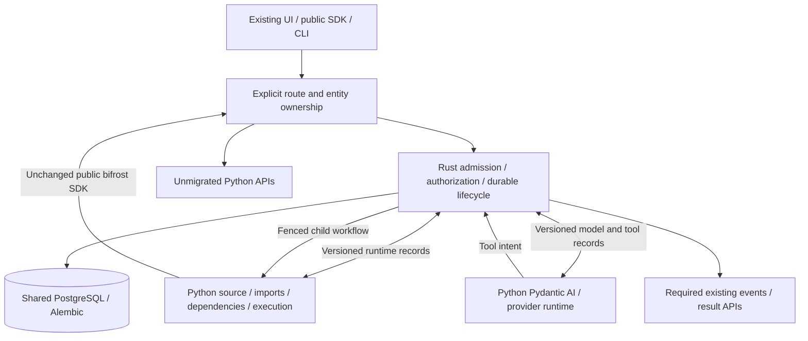

# Amendment: Rust workflow and agent control-plane MVP

Status: active bounded program; architecture gate before authority-bearing code.
Date: 2026-10-01. Architect/build/review model: Sol. This amendment supersedes the
**primary MVP sequencing**, not the compatibility rules, of provisional
[RFC #1005](https://github.com/Midtown-Technology-Group/bifrost/pull/1005).
Nothing here authorizes a broad rewrite, merge or production deployment.

## 1. Reconciled program state

| Authority | Initial reconciliation head (historical) | Disposition |
| --- | --- | --- |
| Platform main | `ba783472b770291e612433ad7ca9564fe671dade` | #1001 ancestor at initial reconciliation |
| Workspace main | `970f3030ef66d20abe83fd7ef0e400cd114da80d` | #1112 ancestor at initial reconciliation |
| RFC #1005 | `2a70092eb773750d6bd082659c2a46b428748654` | Open, provisional; redirect findings resolved |
| Device evidence #1006 | `05bbb1db5426e1b531ed38c37f0aa82dfa71d3f0` | Preserve F-01; device-only STOP |
| Parity #1008 | `09539559961dd22ed3fd3f9179de84bc8f3bd772` | Reuse, extend; retain all device cases/vector |
| Service #1009 | `5ad5010400bf1ade5d1a96cda22684a3f4d6cf35` | Reuse four crates/image/config/DB/tracing/shutdown |

Current source reconciliation is recorded in the [reference gates](rust-core-mvp-reference-gates.md).
As of the latest fetch, platform main is `01cadfe09710d293a40da14d6cf4056165289e31`
and workspace main is `9941427941587d253540942b714c5e2b7abfc410`. Workspace advances
from retained `e8605dc8` include the iDRAC script and Ninja alert reconciliation;
selected Cove inputs and boundary checker bytes are unchanged. The
current workspace audit passes 2,107 boundary files (1,984 standard authored
files), zero forbidden imports and an empty allowlist. Earlier source/test
evidence below retains its actual provenance.

The lifecycle/authority audit used `e77947fab5762e49dd5fdc390bd65ca84bc22c3c`.
The initial pre-PR refresh advanced main through #1010; that seven-file
build/test-cache delta was inspected and changed no lifecycle/authority source.
Later source advancements, including #1023 and #1027, retain separate
reconciliation and evidence pins in the reference gates.
All four PRs are open and unmerged. #1009's complete Rust and ordinary CI passed
apart from CodSpeed analysis. #1008's latest reference run `36829787888` passed
at its exact head; earlier `36827831696` established 90/90 reference/mutant cases.
Review threads in #1005/#1008 are resolved; #1006/#1009 have no inline findings.
The W0 CodSpeed failures above are historical. Maintainer-directed
[#1028](https://github.com/Midtown-Technology-Group/bifrost/pull/1028) retired the
integration and closed [#1003](https://github.com/Midtown-Technology-Group/bifrost/issues/1003)
as not planned. This does not repair those measurements or establish comparable
performance; new evidence follows the controlled load-lab methodology. Do not
rerun historical benchmarks until green or change thresholds.
Normal local pre-PR API type gates previously failed (W0-A 3,944 errors; W0-B
3,954; 89 warnings each). Hosted passes do not waive those gates or prove their
cause. Fresh default-profile Docker readback on `pve-t340` failed a Python
Unix socketpair with `PermissionError` errno 13 in image
`sha256:bc0a14a91bc0ad67b8a30943c56fb779b59101f8b45184a3b3eb5f14a05080cb`.
This diagnostic is not backend proof or a cause for the type failures. Checked-in
settings are not deployed settings. No host security-policy alteration is part
of this program.

At that historical workspace head, its own boundary AST audit inspected **2,100 boundary
Python files** (1,978 standard authored plus Solution/top-level locations), found
zero platform `src.*`/SQLAlchemy imports, and confirmed an empty allowlist.
The import audit found no direct platform dependency requiring accommodation;
unchanged workspace SDK/runtime compatibility remains an acceptance gate. No
workspace files were changed.

The retained authored-source pin remains `83c1cb034dbbcfa29eb1723506735b13b4788536`;
the selected A/B source bytes did not change at the refreshed head. The
[selected reference gates](rust-core-mvp-reference-gates.md) record the source
finding that blocks nominal Cove B: Python drops original-caller provider
authority before its workflow tool's local SDK scope check. A separate correction
or a fully evidenced alternative authored binding is required; Rust cannot infer
the missing flag to make parity pass. Pinned A and control-codec work continue.

The original device experiment was chosen for a bounded protocol/state machine
and an external Go compatibility authority. Its spawn-before-running ambiguity
remains a real separately reviewed blocker. It is not a dependency of workflow
or autonomous-agent execution, and does not establish a global Rust STOP.
Do not implement device routes or change Sopdet/reference behavior here.

## 2. Question and meaningful ownership

Can Rust own workflow and agent control-plane lifecycle while Python executes
Python workloads behind a stable versioned boundary?

Rust ownership means **authoritative migrated decisions and transactions**:
resolve registered entities/source/scope, authorize/admit, create logical and
attempt state, dispatch, accept fenced reports, finalize outcomes, apply required
policy and audit, and decide cancellation/recovery. A Rust HTTP facade calling
Python `run_workflow`/`AgentRunConsumer` is not this outcome.

Initial entity set: read/resolve `Workflow` and `Agent`; immutable Workspace or
Solution deployment/source metadata needed by the selected runs; `Execution`,
`WorkflowExecutionAttempt`, autonomous `AgentRun`, its generic `ExecutionAttempt`,
steps/usage and required existing delivery/lifecycle/audit records. Use existing
schema, not mechanically translated ORM types. Registration compilation and
reviewed Solution delivery remain Python/offline; Rust consumes explicit
registration metadata. Wholesale entity CRUD, chat/delegation/MCP and all policy
engines are outside the first slice.

Python retains source loading/execution, template/fork isolation machinery,
dependency installation and mutable environments, virtual imports, SDK/context,
Pydantic AI/provider adapters, unrelated integrations/CRUD/schedulers/PlatformJobs,
MCP, broad Redis/WebSockets, device control and Alembic. Python-only imports
inside the runtime image may remain initially. Rust must not import Python, use
PyO3, or invoke Python control-plane internals to discover metadata or decide work.

## 3. Source-derived boundaries that must be extracted

| Concern | Current authoritative code | Required MVP boundary |
| --- | --- | --- |
| Workflow resolution/identity | `api/src/routers/workflows.py:846`, `execution/delegation_authorization.py` | Rust admission and effective caller; preserve install/name/org resolution and override rejection |
| Durable submission | `services/execution/async_executor.py:202,363` | Execution-ID advisory lock; immutable runtime/dispatch hashes, retry snapshot, dispatch attempt, PostgreSQL enqueue/publication transaction |
| Workflow claim/start | `jobs/consumers/workflow_execution.py:1824`, `execution/process_pool.py:999` | Extract parent SQL authority; running commit before child receives user work |
| Workflow result | `jobs/consumers/workflow_execution.py:430` | Rust fenced terminal/result/log projection; Python engine returns evidence |
| Recovery/cancel | `jobs/schedulers/execution_cleanup.py:59`, `repositories/executions.py:660` | Explicit ownership/writer exclusion; no competing global Python recovery |
| Agent admission/claim | `execution/agent_run_service.py:123`, `consumers/agent_run.py:735` | Rust run lock, caller/scope, queueing, claim and generic attempt |
| Agent loop | `execution/autonomous_agent_executor.py` and `agent_runtime/` | Retain Python loop/models; remove lifecycle, delegated-run, approval and workflow-admission writes from extracted adapter |
| Agent tools | `execution/agent_workflow_tools.py:44`, `agent_helpers.py:120,158` | Rust attachment/caller recheck, approval/audit where exercised, stable child execution identity |
| Metering/steps | `autonomous_agent_executor.py:585,1482` | Typed reports, durable Rust projection, parity of Redis/event behavior |
| SDK buffering | `api/bifrost/_sync.py:30` | Its pre-commit Redis deletion is reference behavior, not atomicity proof; no unfenced Python completion writer |

Workflow and agent attempts are different contracts. Workflows use
`workflow_execution_attempts` and their secret claim token. Agents use generic
`execution_attempts`; existing agent claims do not supply its optional lease token.
PostgreSQL delivery is a third identity/fence. Workflow delivery completes at
**child dispatch**, not result commit (`jobs/execution_policy.py:193`). A settled
delivery lease cannot authorize a later workflow result. Preserve this distinction.

Do not advertise declared `max_external_calls` or `max_records_read` as enforced:
source establishes duration/output enforcement, not enforcement of every bound.
Source pins do not freeze installed dependencies or the engine/SDK artifact.
Record actual runtime image, interpreter, SDK and lock identity separately from
mutable-template package inventory; never call a requirements-text hash immutable.

The [runtime extraction gates](rust-core-mvp-runtime-extraction-gates.md)
record current-source findings that prevent reusing the worker/template unchanged:
pre-scrub installer/startup authority, broad engine HTTP authority, unfenced Redis
helpers, and OAuth effects behind read-shaped SDK operations. Those gates do not
change existing public behavior or authorize a new runtime credential policy.

## 4. Selected-route authority ledger

Rust must preserve typed transport and original-caller identity, not generic JWT
admin claims. Validate algorithm/issuer/audience/purpose/expiry as reference,
server-build delegated context, recheck current roles/grants where reference does,
and preserve original caller org separately from target org and install.

| Reference fact | Decision for this frontier |
| --- | --- |
| Engine transport is superuser; workflows project delegated caller | Preserve projection on migrated workflow admission; token subject/admin is not effective caller |
| Service tokens use service/attempt/install identity and are non-superuser | Separate capability kind; never authorize via shared system subject alone |
| SDK config scope resolver uses transport superuser | Characterize honestly; no claim of uniform server-side delegated scoping. Freeze selected SDK closure before authority-bearing implementation; any tightening is a separately reviewed difference |
| SDK `agents.run` captures direct transport caller, unlike workflows | Preserve as known existing behavior; nested SDK-agent calls are not an MVP proof until their explicit authority disposition is reviewed |
| `CurrentActiveUser` is not a uniform active-attempt check | Specify route-specific gates; context/renewal checks differ from module/SDK reads |
| Heartbeat DB failures log/retry in current pool | Separate confirmed revocation from unavailable authority; do not claim instantaneous fail-closed shutdown from source |
| Approval dispatch rechecks requester/grants; self-approval rejected | Preserve proposal/strict audit and original requester if exercised; never silently dispatch approval-tagged tools |

First scenarios use a real tenant caller, a registered immutable read-only
workflow and a normal workflow-backed agent tool. No browser/embed/service/API-key
variant is declared migrated without its characterization. An unsupported
migration capability must remain on its explicitly configured Python-owned path;
it must not receive a new public error merely to simplify Rust. Ownership and
Python routing are selected before Rust accepts the run. Discovering unsupported
behavior after possible Start cannot trigger automatic redispatch or rollback.

## 5. Runtime protocol design gate

The [current freeze audit](rust-core-mvp-runtime-freeze-audit.md) names the
remaining source/authority decisions and root dispositions against main #1027.
The private observation codec is a separate test seam, not this runtime protocol.

Implement a language-neutral `bifrost.runtime/v1` contract before orchestration.
It must carry logical kind/ID, the **typed** domain attempt and number, runtime
session/incarnation, registered workflow/agent identity, entrypoint, existing
immutable source/deployment evidence, original caller and org/install scope,
inputs/application context, enforced and advisory limits, control/correlation,
runtime artifact/environment evidence, result/failure and metering records.
No sessions/callables/pickle/SQLAlchemy/Pydantic internals or arbitrary context bag.

One supervised channel, initially framed UTF-8 JSON over private inherited
pipes: `Hello`, `Prepare`, `Prepared`, `Start`, `Heartbeat`, `LogBatch`, `Result`,
`Cancel`, `Stopped`; agent extension includes `ModelObservation`,
`WorkflowToolRequested`, `ToolOutcome`, `Usage`. Version and negotiated capability
must be explicit; unknown versions fail before effects. Headers/credential
provisioning are separate from diagnostic envelopes. Python receives no signing
key and no DML authority on Rust-owned lifecycle tables. Remote transport, if
introduced, must be HTTPS with all credentialed automatic redirects disabled;
actual 301/302/303/307/308 target non-delivery tests remain mandatory.

Prepare creates execution machinery, not permission to invoke user code. Importing
application modules and running their initialization counts as user code: Prepare
must not import an entrypoint with possible effects. Rust
commits the attempt's running/start authorization before Start permits effects.
A lost Start acknowledgement is possible execution, not permission for replay.
Results bind to the supervised process/session and stored fence, not runtime-
supplied IDs. Runtime cannot report coordinator-only worker loss or issue grants.
Transport receipt acknowledgement and terminal outcome are separate events.

Agent Python retains model loop, retries/failover, budgets and argument validation.
It emits a typed workflow-tool intent; Rust authorizes/adopts one stable child
execution and returns its actual outcome. A single bidirectional supervisor
protocol is necessary, not a mesh of calls back into Python queue/auth/lifecycle
services. Provider credentials are scoped provisioning, not global app secrets.

**Not yet frozen:** exact message JSON/validation/nullability and report mapping;
durable tool-intent receipt/duplicate/conflict storage; compatible canonical
hash/encryption vectors; explicit ownership markers and Python writer exclusion;
rollback of in-flight ownership; SDK credential projection. Existing AgentRunStep
has no unique `(run_id, step_number)` and cannot alone prove durable report
idempotency. These decisions block control-plane builders, not reference research.
Any additive schema uses current Alembic; no competing migration history or
new parallel logical-job table. Scope ownership must be explicit and language-
neutral; a separate queue alone does not fence global Python cleanup.

### Mechanical writer exclusion: mandatory C2/C3 gate

[Maintainer feedback on #1011](https://github.com/Midtown-Technology-Group/bifrost/pull/1011#issuecomment-5934157212)
supports the direction subject to enforceable writer exclusion and honest runtime
extraction. The requirement is technical authority, not an adapter promise.

The preferred mechanism is separate, non-superuser, non-table-owner database
identities for the incumbent control plane and Rust coordinator, with immutable,
language-neutral lifecycle ownership on shared logical rows and owner-aware
PostgreSQL write guards for their dependent projections. Extracted Python
runtimes receive **no lifecycle DML credential or signing key**; any narrowly
required source/provider reads must use a separately reviewed read-only identity
or public operation. Table grants alone cannot partition two owners' rows in the
same table. Guard/RLS design, allowed ancillary fields and actual role provisioning
must be ratified and tested before C3; this amendment does not authorize a guessed
migration or declare the mechanism implemented.

Required evidence before C2 acceptance or C3 authority-bearing implementation:

- Read back actual database identities and privileges through the supported
  connection path, including PgBouncer. Both coordinators must not collapse to
  one unrestricted role. Neither application identity may own protected tables,
  bypass the guards, inherit the other identity, or obtain its authority through
  role switching or writable session settings. Test the identity used inside any
  privileged guard function; a privileged function owner is not caller identity.
- Under the runtime's actual credentials and inherited environment, deliberately
  attempt direct execution/run creation, attempt creation/retry, claim/start,
  terminal/result/step/usage writes and prohibited lifecycle operations through
  credential-bearing HTTP. They must be denied without mutation or publication.
  Required public SDK operations still work; negative authority proof cannot be
  obtained by breaking authored code or silently narrowing its public contract.
- Against one shared PostgreSQL database, prove that incumbent workflow/agent
  consumers, cleanup schedulers, cancellation, poison/recovery, repository helpers
  and local/CLI completion paths cannot mutate core-owned lifecycle state or
  launch/retry it. Exercise wrong-owner, stale-token and concurrent writers;
  assert committed rows and events, not only an HTTP denial or mocked helper.
  Application ownership checks precede Redis deletion/publication and possible
  runtime effects; database guards are the backstop. A queue split is insufficient.
- Name retained ancillary writers explicitly. Summarization, annotation, metadata,
  authorized deletion/redaction and their referential actions must preserve their
  existing contracts without broad permission to finalize a run. Freeze their
  field/projection authority and locking rules; no whole-service/table exemption.
- Exercise normal execution and result projection with these restrictions active,
  cancellation adjacent to completion, worker/coordinator loss after possible
  Start, and rollback while accepted work is active. No credential substitution,
  disabled guard, unrestricted test role, data repair or blind replay earns parity.

If a different mechanism is proposed, the architect must document why it gives
at least the same exclusion and accept the same negative/mixed-writer evidence
before builders proceed. Sharing an unrestricted PostgreSQL role is not an
acceptable fallback. Rust decides admission/retry/finalization; Python reports
workload evidence. Hidden cleanup/helper authority is a failed C2 extraction,
not a task deferred until after C3.

### Protocol growth follows executable scenarios

The listed message vocabulary is a candidate menu, not permission to implement a
permanent runtime bus. C1-P0 remains the partial control profile. Add workload,
result/log and agent-specific records only when the unchanged selected workflow
or agent reference requires them, with a source-to-field map and valid/invalid
cross-language vectors. Unsupported capabilities remain on their explicitly
selected incumbent path before ownership; no post-Start fallback or silent tool
catalog reduction. Keep one supervisor boundary and preserve model/runtime
logic in Python instead of building generic service callbacks or a second agent
framework. C2-W and C2-A are independent high-risk acceptance gates, even when
Rust HTTP and SQL code appears straightforward.

## 6. Representative scenarios and honest evidence

A: execute an existing workspace read-only workflow unchanged, from pinned source,
through Rust-owned admission/attempt/result APIs; use a normal public SDK request,
assert its actual successful scope-sensitive response, durable state and context.
Candidate: `features/utilities/workflows/check_integration_readiness.py` at the
workspace baseline with synthetic integration config, no vendor connectivity.
Its exception-catching means merely returning a result is insufficient: assert
SDK request evidence and the configured readiness result. Also characterize
failure, cancel, source-pointer change and stale callbacks.

B: execute an existing active agent or production-shaped existing fixture via
`POST /api/agent-runs/enqueue`, normal caller/org and one granted read-only workflow.
First model response calls the actual tool; second observes the actual workflow
result and returns output. Compare six ordered model/tool steps, usage, attempts,
run/result and required events. The selected existing asset is Cove Recovery Steward Escalation Analyst
(`agents/387064f6-af8d-4b88-97b4-adbf0207a2fa.agent.yaml`), active with two read-only
workflow tools and no delegated-agent/MCP/knowledge catalog. Retain its exact
declaration, prompt and grants. The main Cove Recovery Steward includes a
delegated-agent grant; dropping that catalog entry would change model requests
even if unused. It stays Python-owned until that profile is supported. Never
activate the retired AutoElevate agent. Existing E2E tool/agent fixtures
are available as early characterization, not substitutes for final real-asset proof.

A deterministic HTTP model emulator must use the actual Python provider adapter
and real queue/worker/DB/tool execution. No patched executor/tool callback proves
this path. Label it model-emulator integration, not real-vendor compatibility.
A bounded separately authorized credential-bearing vendor run is an additional
acceptance gate; do not change global model assignments or silently incur charges.

Known source discrepancy: ordinary agent cancel writes `cancelling`, but final
consumer projection checks only `running`; cleanup excludes `cancelling`, while
chat and interrupted-delivery recovery differ. Characterize before promising a
terminal cancel; do not silently fix or generalize a source-only finding.

## 7. Work packages and dependency frontier

Keep the four W0 crates; do not add speculative crates. Existing `Observation`,
HTTP adapter and capture/comparator principles are reused; generalize the seam,
not delete device coverage. Local integration of open foundations is a candidate,
not a merge into main. Architect owns shared test/Compose/proxy/CI integration.

| Package | Owned paths / behavior | Depends on | Exit / stop gate |
| --- | --- | --- | --- |
| C0-D amendment | This doc; device status clarification in #1006; no business code | Current-main/review/source audit | First plan recorded; provisional decisions named |
| C1-P runtime contract | `contracts/runtime/v1/**`; Rust contracts runtime module; Python runtime codec module; isolated codec/vector tests | Architect-ratified exact schema and current W0 integration | Actual Python/Rust valid/invalid vectors and drift detection; stop on unfrozen authority/field guesses |
| C1-R reference/parity | `api/tests/parity/core/**`, `contracts/parity/core/**` | W0-B; selected scenario/authority ledger | Real Python workflow + provider/tool loop, committed DB/event/provider capture and meaningful mutants; stop on mock execution, unsupported environment or hidden normalization |
| C2-W runtime extraction | Narrow Python runtime adapter, targeted worker/engine interface, no SDK method rename | C1-P/C1-R accepted; credential/source/buffer decisions; mechanical writer-exclusion design | Unchanged workflow under actual restricted credentials; direct/helper/cleanup create-retry-finalize denial; cancellation/start ambiguity; stop if Python retains lifecycle authority |
| C2-A model runtime extraction | Python agent runtime adapter and narrow loop/toolset seam | C1-P/C1-R; tool-intent receipts/credential decisions; mechanical writer-exclusion design | Actual provider/tool loop under restricted credentials; independent run/attempt/retry/finalize and hidden writer denial; stop on callback mesh or lost step/usage semantics |
| C3-W Rust workflow control | Existing domain/db/core modules for selected resolution/auth/admission/attempt/result/delivery | Accepted C2-W plus verified mechanical writer exclusion + crypto/hash vectors | Rust execution authority, duplicates/conflicts, stale fences, attempt/state/events and scoped SDK parity; stop on schema duplication or reference drift |
| C3-A Rust agent control | Existing domain/db/core agent modules; shared typed intent handler owned by architect | Accepted C2-A and C3-W; verified mechanical writer exclusion | Run/attempt authority, grant/approval recheck, one stable workflow dispatch and durable metering; stop on caller loss or replay |
| C4-I coexistence/routing | Test/Compose/current nginx/Vite/service wiring and runbook | Independent C3 review | Python-created/Rust-read and converse, competing writers, cleanup/cancel races, live in-flight rollback without data repair/dual execution |
| C5-G decision | Parity/known differences/ownership/rollback/resource and go/no-go reports | All acceptance evidence | Concrete CONTINUE/STOP; no semantic debt hidden by performance |

All packages exclude unrelated CRUD, devices, generic PlatformJobs, unselected
policy engines and general policy-engine ports, MCP/WebSocket/provider ports,
migration ownership and production deployment. Selected authorization, grants
and admission policy remain required. C1-P requires architect-ratified exact
runtime schema. C1-R may independently characterize reference behavior after its
selected capture scope and existing Observation interface are reviewed. C2/C3 cannot invent unresolved authority, ownership or recovery.
Every package runs scoped supported tests, quality where affected, clean-candidate
`./test.sh pre-pr` and narrow PR feedback. Rust also runs fmt, all-feature Clippy
with `-D warnings`, tests and unchanged security/license/image CI. Builders report
ambiguity rather than alter public responses, scope or schema history.

First implementation frontier: **C1-P0 control-profile codecs and cross-language
vectors** for Hello/Start/Heartbeat/Cancel/Stopped, with explicit parent-provided
prepared binding. Closed framing is ratified internally at 16 MiB/depth 64; it
creates no public size limit or full runtime-handoff claim. Workload/source/result
projection remains gated by real vectors and the unresolved decisions above.
No public-route or SQL lifecycle ownership belongs to this frontier. C1-R can characterize in
parallel after its capture scope is frozen. The first production-shaped ownership
PR is C3-W; codec success alone is not a core-control-plane MVP success.

## 8. Acceptance and decision

CONTINUE only after both real-asset workflow and agent runs use Rust-authoritative
control, Python execution behind the versioned boundary, public API/SDK parity,
original caller/org/grant/audit preservation, safe shared schema, trusted drift
capture and tested rollback without workspace/data accommodation. Keep W0 healthy
and device coverage. Ordinary CI/normal gate failures retain blocking dispositions.

STOP the affected slice if no clean authority boundary exists, protocol serializes
Python internals, Python still makes authoritative lifecycle decisions, SDK/workspace
changes are necessary, owner exclusion requires broad duplicate schema, actor scope
weakens, ambiguous effects replay, or rollback repairs data. Keep useful W0/parity
work. Device F-01 does not by itself satisfy a core-program abort criterion.

Current core disposition: **CONTINUE boundary design/reference work; authority-
bearing implementation gated**. This is not an MVP completion recommendation.
At completion name the validated next domain and intentionally retained Python,
or the exact falsification, narrower Rust role and retirement/revert plan.

The independent [C1-R agent reference packet](rust-core-mvp-agent-reference.md)
records unchanged authored inputs, the approved unmerged AUTH source overlay,
named-lane custody, model wire and passive-observation boundaries. Its lane
foundation is source/static evidence only. Closed observation messages and
shutdown completeness must be frozen before observer/fixture implementation;
public installation and actual reference execution remain pending. This work
cannot restart the exhausted #1017 repair cycle or confer CRED/C2/C3 acceptance.
